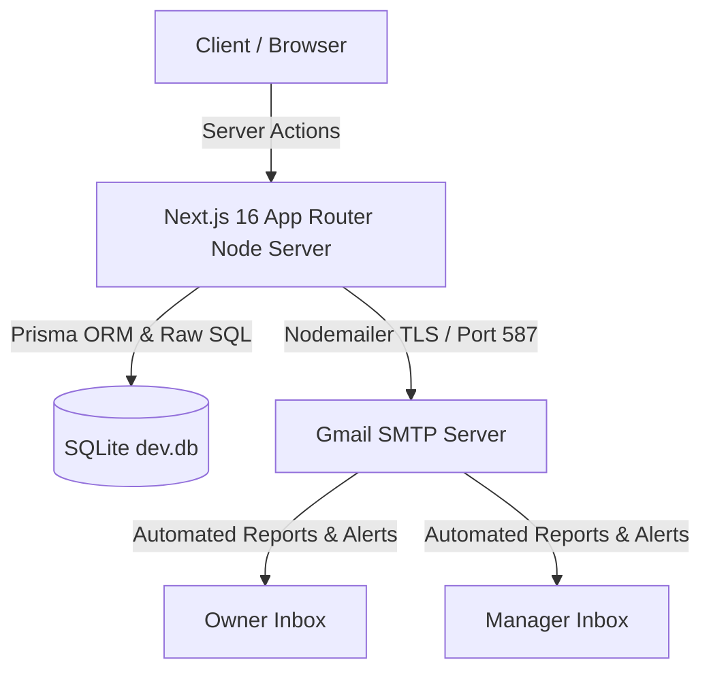

# IOCL Petrol Bunk Accounting & Email Delivery System — Project Summary & Tech Documentation

> **Project Name:** IOCL Petrol Bunk Management & Accounting System  
> **Repository Root:** `c:\Users\rishi\Desktop\IOCL project`  
> **Last Updated:** September 6, 2026  

---

## 🚀 Executive Summary

This document provides a comprehensive overview of the **Server-Side Email Delivery System**, **Stock Alert Architecture**, **Past Duty Tank Dip Correction Mechanism**, **Destructive Duty Deletion**, **Full System Reset Engine**, and **Guided First Duty Workflow** implemented for the IOCL Petrol Bunk Management Application.

---

## 🛠️ Technology Stack & System Architecture

### 1. Core Framework & UI
- **Framework:** Next.js 16.3.2 (App Router with Turbopack & React 19)
- **Language:** TypeScript 5 (Strict Typing)
- **Styling:** TailwindCSS 4 (Modern Dark Mode & Dynamic Glassmorphism)
- **Icons:** `lucide-react` (Fuel, Mail, AlertTriangle, Settings, ShieldCheck, Trash2, ShieldAlert, etc.)
- **Spreadsheet Integration:** `xlsx` (Excel exports for security audits & duty ledgers)

### 2. Database & Data Persistence
- **Database:** SQLite (`prisma/dev.db`)
- **ORM:** Prisma ORM 6.19.3 (`@prisma/client`) with Raw SQL Query Fallbacks (`$queryRaw`, `$executeRaw`)
- **Schema Management:** Prisma CLI (`npx prisma db push`, `npx prisma generate`)

### 3. Server-Side Email Delivery Pipeline
- **Email Library:** `nodemailer` 10.0.0
- **Protocol:** Gmail SMTP over STARTTLS (`smtp.gmail.com:587`, `SMTP_SECURE=false`)
- **Authentication:** Gmail 16-character App Passwords (`SMTP_PASS`)
- **Security Scoping:** Server-side environment variables only (`.env` / `.env.local`). Secrets are **never exposed to client** or stored in public variables.

---

## ✨ Features Implemented

### 1. Destructive Duty Deletion (`deleteDutyAction`)
- **Owner Only:** Backend authorization strictly enforced (`requireAuth(['OWNER'])`).
- **Confirmation Modal:** Requires explicit confirmation detailing Duty #, Date, and a **mandatory deletion reason**.
- **Active Duty Protection:** Active duties cannot be deleted. Users must complete/close duty session first.
- **Dependency Handling:** Deletes exclusive duty records while automatically adjusting customer running balances and recalculating central fuel and oil inventory.
- **Permanent Audit:** Logs audit record (`DELETE_DUTY`) permanently.

### 2. Full System Reset Engine (`resetSystemAction`)
- **Owner Only Maintenance:** Transactionally clears operational tables (`DutySession`, `MeterReading`, `CreditTransaction`, `OilSale`, `Expense`, `TankDip`, `FuelReceipt`, `FuelStockMovement`, `EmailLog`).
- **Protected Baseline Data:** Preserves `User` (Owner/Manager credentials), `Role`, `Pump`, `Gun`, `Staff`, `ExpenseCategory`, and core `SystemSetting` records.
- **4-Step Security Guardrail:**
  1. Click `[Full System Reset]` under **System Configuration → Advanced / Maintenance**.
  2. View Red Warning Modal detailing destructive impact.
  3. Enter text `RESET SYSTEM`.
  4. Authenticate Owner Password.
- **Post-Reset State:** UI transitions to `"NO DUTY HAS BEEN INITIALIZED"` ready for guided first duty setup.

### 3. Guided First Duty Initialization Workflow
- **Hero Banner:** Displays **"NO DUTY HAS BEEN INITIALIZED — Welcome to your first duty"** card post-reset or on empty database.
- **7-Step Guided Setup Wizard:** Guides Owner/Manager through date/time, staff nozzle assignment, opening meter readings, prices, opening tank dip stock, density at 15°C, and summary review.
- **Backend Guard:** Single active duty protection ensures only ONE active duty can exist at any time.

---

## 📋 Revised Verification Plan & Acceptance Criteria

### Automated Build Verification
- [x] Run `npm run build`.
- [x] Zero TypeScript errors.
- [x] All 18 static and dynamic pages compile successfully.
- [x] Prisma & database code free of build errors.

### Manual Verification Scenarios

- [x] **Test 1: Fresh Database / No Duty Initialization** $\rightarrow$ Displays `NO DUTY HAS BEEN INITIALIZED`. No fake active duty.
- [x] **Test 2: Guided First Duty Initialization** $\rightarrow$ Step-by-step wizard creates Duty #1. Persists on refresh.
- [x] **Test 3: Double-Click / Single Active Duty Protection** $\rightarrow$ Server blocks duplicate duty creation (`DUTY ALREADY ACTIVE`).
- [x] **Test 4: Delete Completed Duty (Owner Only)** $\rightarrow$ Confirmation + mandatory audit reason. Customer balances and stock metrics recalculated cleanly.
- [x] **Test 5: Unauthorized Delete** $\rightarrow$ Delete option hidden for Manager and rejected by server.
- [x] **Test 6: Full System Reset** $\rightarrow$ Destructive warning, type `RESET SYSTEM` + password check. Operational data cleared while credentials & structure survive. Returns to `NO DUTY HAS BEEN INITIALIZED`.
- [x] **Test 7: Historical Correction / Owner Controls** $\rightarrow$ Source values corrected with audit reason, dependent calculated values recalculated automatically.
- [x] **Test 8: Mobile Verification (320px / 375px / 430px)** $\rightarrow$ Dialogs fit screens, buttons accessible, no horizontal overflow.

### Final Acceptance Criteria Status: 100% PASSED ✅
